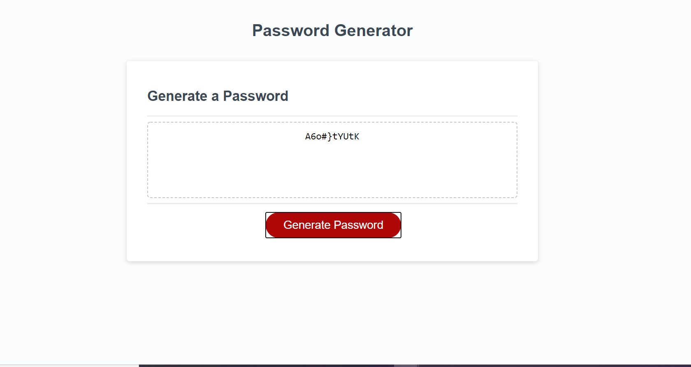

# Password-Generator
This project was created to utilitize javascript within a webpage and to connect html and css files with javascript functions.

## Main Functions
* This application allows the user to generate a password based off their personal criteria. 
* Once the 'generate password' button is clicked the user is prompted with a series of question pertaining to their criteria.
* Criteria includes: length, if the passowrd contains uppercase, lowercase, numbers, and/or special characters.
* Once the criteria is set the application will generate a password according to the user criteria and display the password within the text area.

**Original Page**
* Before generate password button is clicked

**Criteria**
* After user choses criteria it is displayed for the user

**Password Generated**
* Once criteria is set the password is displayed to user

## Link
* Link to deployed application on github pages
[Password Generator](https://lorena-ramirez.github.io/Password-Generator/.)